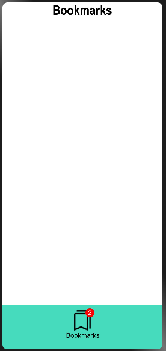
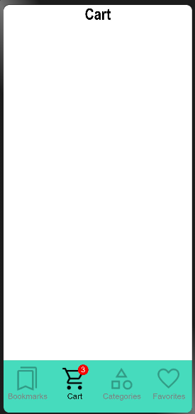
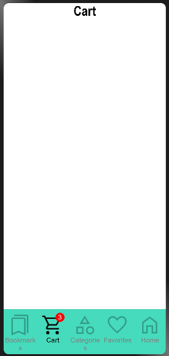

# Bottom Navigation
****
Bottom navigation bars allow movement between primary destinations in an app.
## Dependencies
****
For using BottomNavigation in your app, add the below dependency in the entry/package.json  
```
"dependencies": {
    "@ohos/bottomnavigation": "file:../BottomNavigation"
}
```
Add dependency command with
```
npm i @ohos/bottomnavigation
```
## Usage instructions
****
Import these components and data types
```
import {BottomNavigationOptions,BottomNavigation,BottomNavigationData} from "@ohos/bottomnavigation"
```
## Screenshots
****
 


## How to use it
***
### Imports
Import the following components and data types
```
import {BottomNavigationOptions,BottomNavigation,BottomNavigationData} from "@ohos/bottomnavigation"
```
### Code
To pass the data for bottom navigation bar, create a State variable like this
```
@State bottomNavigationData: BottomNavigationData[]= [
    {
      icon: $r("app.media.bookmarks"),
      label: "Bookmarks",
      badge: 1
    },
    {
      icon: $r("app.media.cart"),
      label: "Cart",
      badge: 2
    },
    {
      icon: $r("app.media.categories"),
      label: "Categories"
    }
   ]
```

To add the bottom navigation bar
```
BottomNavigation({
        bottomNavigationData: $bottomNavigationData,
        options: {
          callbackFunction: this.callBackListener.bind(this),
          containerBackgroundColor: Color.White,
          rippleEnabled: true,
          labelVisibility: true,
          labelInactiveColor: Color.Grey,
          labelActiveColor: Color.Black
        }
      })
```
## Styling
****
You can style the viewer using these attributes :

| Attribute  | Description  |
| ------------ | ------------ |
| callbackFunction | sets the callback Listener for the bottom navigation bar  |
| containerBackgroundColor | sets the background color of the bottom navigation bar  |
| containerElevation | sets the elevation effect of the bottom navigation container   |
| rippleEnabled | sets whether the ripple effect is enabled or not   |
| labelVisibility | sets whether the label is visible or not  |
| labelInactiveColor | sets the color of the label when it is inactive  |
| labelActiveColor | sets the color of the label when it is active |

## Compatibility
****
Supports OpenHarmony API version 9
## Code Contribution
****
If you find any problems during usage, you can submit an [issue](https://github.com/Applib-OpenHarmony/MaterialBottomNavigation/issues) to us. Of course, we also welcome you to send us PR.
## Open source License
****
This project is based on [Apache License 2.0](./LICENSE), please enjoy and participate in open source freely.

